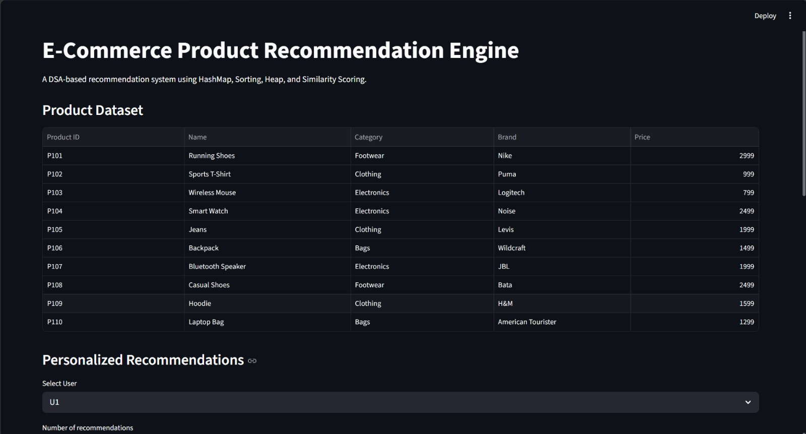
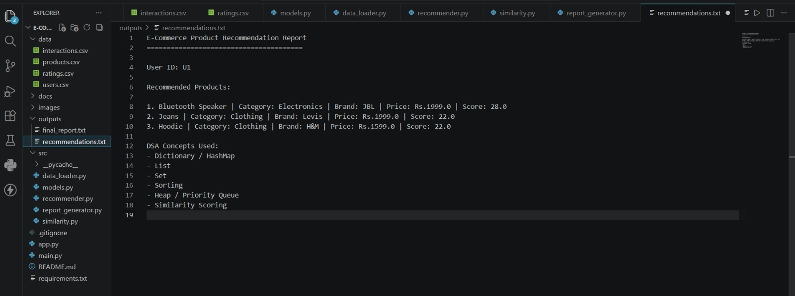
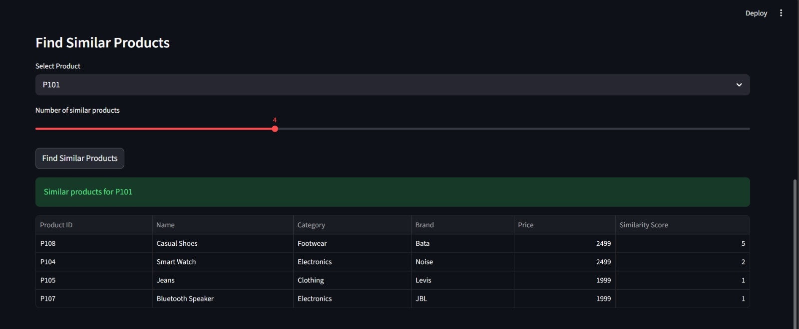
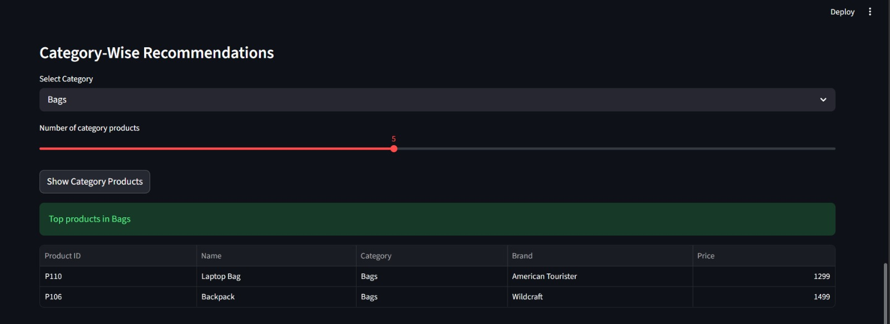
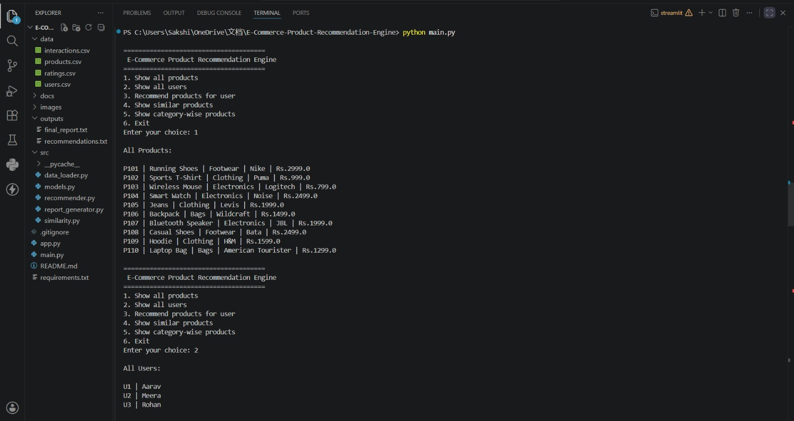

# E-Commerce Product Recommendation Engine

A Python-based E-Commerce Product Recommendation Engine that recommends products using user activity, product similarity, ratings, category matching, sorting, and priority queue logic.

This project is built as a DSA-focused proof-of-work project with both:

- CLI interface
- Streamlit web interface

---

## Project Overview

Online shopping platforms recommend products based on user behavior such as views, cart activity, purchases, ratings, and product similarity.

This project simulates a basic recommendation engine like the ones used by platforms such as Amazon, Flipkart, Myntra, and other e-commerce apps.

The system recommends products by analyzing:

- User purchase history
- Viewed products
- Cart items
- Product category
- Product brand
- Product price similarity
- Product ratings

---

## Problem Statement

In e-commerce platforms, users often see thousands of products. A recommendation system helps users discover relevant products faster.

This project solves the problem of product discovery by generating personalized product recommendations using DSA-based logic.

---

## Features

- Product dataset management
- User dataset management
- User interaction tracking
- Product rating support
- Personalized product recommendations
- Similar product recommendations
- Category-wise product recommendations
- Top-N recommendation using heap / priority queue
- Report generation
- CLI-based interface
- Streamlit web interface

---

## DSA Concepts Used

- Dictionary / HashMap
- List / Array
- Set
- Sorting
- Heap / Priority Queue
- Searching
- Similarity scoring
- Filtering
- Ranking algorithm

---

## Tech Stack

- Python
- CSV files
- Streamlit
- Heapq module
- File handling

---

## Folder Structure

```text
E-Commerce-Product-Recommendation-Engine/
│
├── data/
│   ├── products.csv
│   ├── users.csv
│   ├── interactions.csv
│   └── ratings.csv
│
├── src/
│   ├── models.py
│   ├── data_loader.py
│   ├── similarity.py
│   ├── recommender.py
│   └── report_generator.py
│
├── outputs/
│   └── recommendations.txt
│
├── images/
│   └── screenshots
│
├── docs/
│
├── main.py
├── app.py
├── README.md
├── requirements.txt
└── .gitignore
```
## How The Recommendation System Works

Product Data + User Data
        ↓
User Interactions
        ↓
Similarity Score Calculation
        ↓
Filter Already Seen Products
        ↓
Ranking Using Score
        ↓
Top-N Recommendation Using Heap
        ↓
Final Recommended Products

## Recommendation Logic
The system calculates similarity using:

Same category = +3
Same brand = +2
Price difference <= 500 = +2
Price difference <= 1000 = +1

User activity is weighted as:

View = 1
Cart = 3
Purchase = 5
Higher activity weight means stronger recommendation influence.

## Installation
Clone the repository:

git clone YOUR_REPOSITORY_LINK
cd E-Commerce-Product-Recommendation-Engine

Install dependencies:

pip install -r requirements.txt

Run CLI Version
python main.py

CLI menu:

1. Show all products
2. Show all users
3. Recommend products for user
4. Show similar products
5. Show category-wise products
6. Exit

Run Web Version
streamlit run app.py
Then open:
http://localhost:8501

Sample Output
Recommended products for U1:

1. Smart Watch | Electronics | Noise | Rs.2499.0 | Score: 15.0
2. Jeans | Clothing | Levis | Rs.1999.0 | Score: 9.0
3. Backpack | Bags | Wildcraft | Rs.1499.0 | Score: 3.0

## Screenshots

### Streamlit Web Interface



### Personalized Recommendations



### Similar Products



### Category-Wise Products



### CLI Menu




## Output Report
The system generates a recommendation report at:

outputs/recommendations.txt
The report contains:

- User ID
- Recommended products
- Product category
- Brand
- Price
- Recommendation score
- DSA concepts used

## Learning Outcomes
Through this project, I learned:

- How recommendation systems work
- How e-commerce platforms suggest products
- How to use HashMap for fast lookup
- How to use Set for filtering
- How to rank products using scores
- How to use Heap / Priority Queue for Top-N results
- How to structure a Python project
- How to build both CLI and web-based project    versions

## Future Scope
- Add real product images
- Add login system
- Add database support using SQLite or MySQL
- Add machine learning ranking model
- Add collaborative filtering
- Add FastAPI backend
- Add advanced React frontend
- Deploy the web app online

## Author
Your Name


